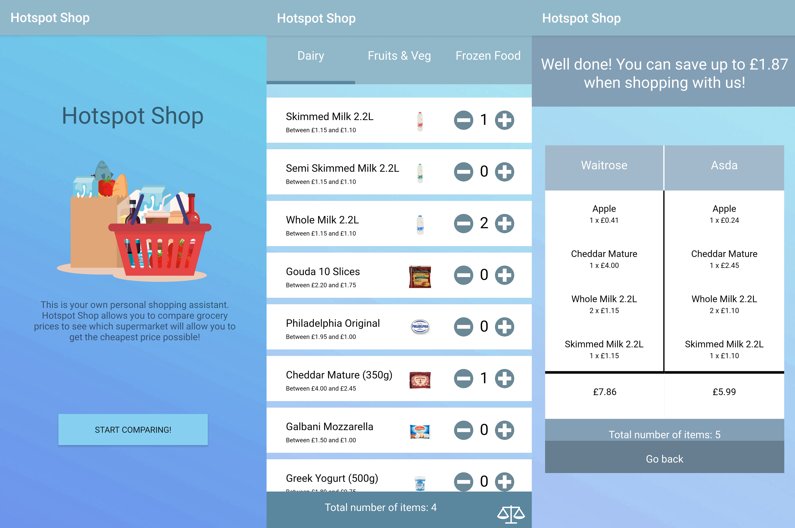

# HotspotShop
**An app that allows you to compare groceries between supermarkets.**

Build originally for TSE (Team Software Engineering) module for a university project, the android app allows you to compare basic groceries' prices between Waitrose and Asda. It gives you an estimate how much you can save by going to one or the other supermarket. The app is written for Android in Java however the actual comparison and displaying of the items is done as a web application in HTML, CSS & JS.  

#####In a above screenshot you can see all how the app works. Starting from the left, the app opens up the splash screen giving you basic information about the app. Once you press the Start Comparing! button, you are taken to the list of the items. This is where you have 3 basic categories to choose from and you can proceed to add the items to your basket. Once you chosen the items you want to purchase, you simply press the comparison button which takes you to the most right screen where you can see exactly how much it would cost to do the shopping in each supermarket and the total saving. Unfortunately since most supermarkets don't allow prices scraping for comparison purposes, I used the only ones that did allow it, Waitrose and Asda.#####
